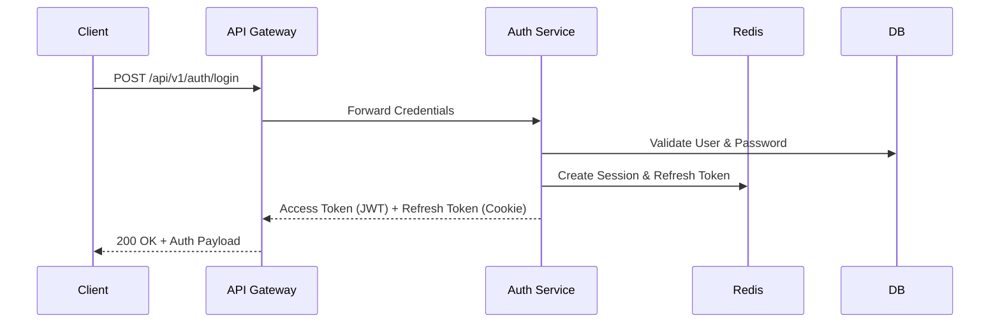
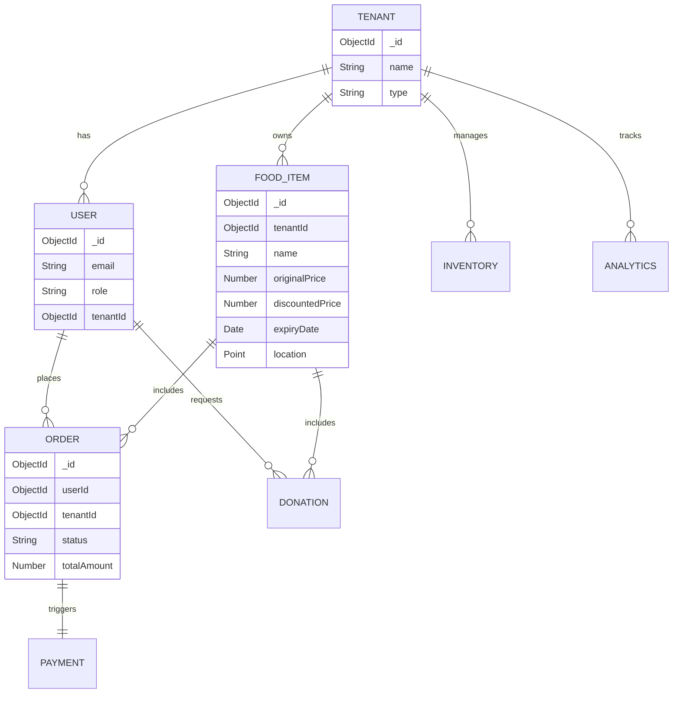
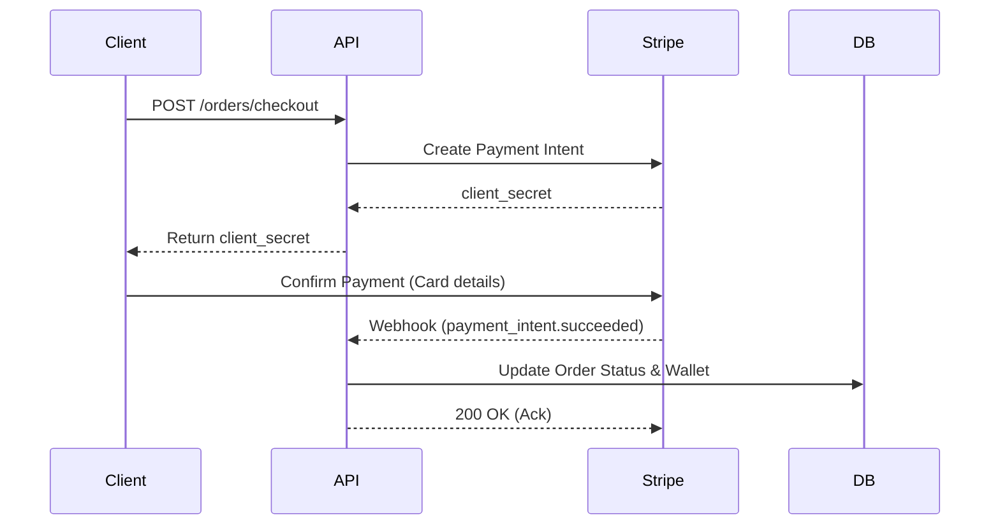
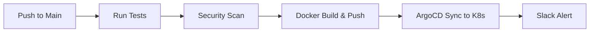

# ZeroWaste OS — Enterprise SaaS Architecture & Blueprint (Phase 2)

This document outlines the Phase 2 architectural design for **ZeroWaste OS**, detailing the production-grade infrastructure, security, microservices, databases, observability, AI integration, and CI/CD strategies necessary for enterprise deployment.

---

## 1. Enterprise Authentication & Authorization

### Overview
A robust identity and access management (IAM) system is foundational for ZeroWaste OS, serving consumers, Food Business Operators (FBOs), NGOs, and Admins.

### Architecture Explanation
* **JWT + Refresh Token Rotation**: Access tokens are short-lived (15 minutes). Refresh tokens are stored in HttpOnly, Secure cookies and rotated upon use to mitigate token theft.
* **OAuth**: Single Sign-On (SSO) via Google and Microsoft for enterprise FBOs and NGOs.
* **RBAC & ABAC**: Role-Based Access Control (Admin, FBO, NGO, Consumer) handles primary permissions. Attribute-Based Access Control handles contextual permissions (e.g., FBO can only edit their *own* tenant's food items).
* **MFA**: Multi-Factor Authentication via TOTP (Authenticator App) or SMS.
* **Session & Device Management**: Active sessions tracked in Redis; users can revoke access for specific devices.

### Mermaid Diagram


### TypeScript Interfaces
```typescript
export interface IAuthPayload {
  userId: string;
  tenantId?: string;
  role: 'ADMIN' | 'FBO' | 'NGO' | 'CONSUMER';
  permissions: string[];
}

export interface ISession {
  sessionId: string;
  userId: string;
  deviceInfo: string;
  ipAddress: string;
  createdAt: Date;
}
```

### Express Implementation Snippet
```typescript
import jwt from 'jsonwebtoken';
import { Request, Response, NextFunction } from 'express';

export const requireAuth = (req: Request, res: Response, next: NextFunction) => {
  const token = req.headers.authorization?.split(' ')[1];
  if (!token) return res.status(401).json({ error: 'Unauthorized' });

  try {
    const payload = jwt.verify(token, process.env.JWT_SECRET!) as IAuthPayload;
    // Attach user to request
    (req as any).user = payload;
    next();
  } catch (err: any) {
    if (err.name === 'TokenExpiredError') {
      return res.status(401).json({ error: 'TokenExpired', message: 'Use refresh token' });
    }
    return res.status(403).json({ error: 'Forbidden' });
  }
};
```

### Design Decisions & Security
* **Decision**: Store refresh tokens in `HttpOnly` cookies to prevent XSS extraction.
* **Password Policy**: Minimum 12 characters, requiring uppercase, lowercase, number, and special character.
* **API Keys**: For enterprise integrators, API keys are hashed (SHA-256) before DB storage. Only a prefix and the hash are stored.

---

## 2. Enterprise Security

### Overview
ZeroWaste OS adheres to OWASP Top 10 standards to protect tenant data, prevent injections, and ensure secure communication.

### Architecture Explanation
* **Helmet & CORS**: HTTP headers secured using `helmet`. Strict CORS origins configured per environment.
* **CSRF**: Double Submit Cookie pattern implemented for web clients.
* **Rate Limiting**: Redis-backed rate limiting (e.g., 100 req/min per IP, stricter on `/auth`).
* **Input Validation**: Joi/Zod for strict schema validation.
* **XSS & Mongo Injection Prevention**: Data sanitization middleware strips `$`, `.`, and script tags.
* **Secrets Management**: HashiCorp Vault or AWS Secrets Manager injects secrets into containers at runtime.
* **Encryption**: TLS 1.3 in transit. AES-256-GCM for encryption at rest (MongoDB Atlas).

### Express Implementation Snippet
```typescript
import helmet from 'helmet';
import rateLimit from 'express-rate-limit';
import mongoSanitize from 'express-mongo-sanitize';
import xss from 'xss-clean';

// Apply security headers
app.use(helmet());

// Rate Limiting
const apiLimiter = rateLimit({
  windowMs: 15 * 60 * 1000, // 15 minutes
  max: 100, // Limit each IP to 100 requests per window
  standardHeaders: true,
  legacyHeaders: false,
});
app.use('/api/', apiLimiter);

// Data Sanitization
app.use(mongoSanitize()); // Prevent NoSQL Injection
app.use(xss()); // Prevent XSS
```

---

## 3. Complete Database Design

### Overview
The database layer uses MongoDB Atlas. We separate concerns into distinct collections while maintaining references for complex aggregations.

### Mermaid ER Diagram


### Collections Breakdown
1. **Users**: Credentials, roles, and profiles.
2. **Tenants**: FBO and NGO metadata, settings, subscription tiers.
3. **Food Items**: Surplus food listings, pricing, and expiry.
4. **Orders**: Consumer purchases (Marketplace).
5. **Donations**: B2B NGO food allocations.
6. **Inventory**: Real-time stock levels.
7. **Marketplace**: Denormalized read-heavy collection for the search engine.
8. **Analytics**: Time-series data for KPI aggregations.
9. **Notifications**: In-app alert history.
10. **Payments**: Transactions and refund status.
11. **Audit Logs**: Immutable history of state changes (Phase 1).
12. **Feature Flags**: Tenant-specific toggles.
13. **AI Predictions**: Historical demand forecasts.

---

## 4. Microservice Architecture

### Overview
A domain-driven microservice architecture allows independent scaling of high-traffic services (like Search and Orders) while isolating compute-heavy workloads (AI).

### Architecture Explanation
* **API Gateway (Kong/Nginx)**: Routes traffic, terminates SSL, handles global rate limiting.
* **Services**: Gateway, Auth, Food, Marketplace, Orders, Donation, Notification, Analytics, AI, Payments, Admin.
* **Communication**:
  * **Synchronous**: REST/gRPC for direct queries (e.g., Order calling Payment).
  * **Asynchronous**: BullMQ + Redis for background tasks (e.g., Order triggering Notification).
  * **Realtime**: WebSockets for live updates.

### Deployment Diagram
```mermaid
flowchart TD
    Client[Web/Mobile Clients] --> Gateway[API Gateway / Ingress]
    
    Gateway --> AuthSvc[Auth Service]
    Gateway --> MarketSvc[Marketplace Service]
    Gateway --> OrderSvc[Order Service]
    Gateway --> PaymentSvc[Payment Service]
    Gateway --> AISvc[AI Service (FastAPI)]
    
    OrderSvc -- Async Event --> RedisMQ[(Redis / BullMQ)]
    MarketSvc -- Async Event --> RedisMQ
    
    RedisMQ --> NotifySvc[Notification Service]
    NotifySvc --> WS[WebSocket Server]
    WS --> Client
    
    OrderSvc -- Sync (REST) --> PaymentSvc
```

### Scalability Considerations
Stateless services allow horizontal pod autoscaling (HPA) in Kubernetes. The AI service requires GPU node pools and scales based on queue depth metrics.

---

## 5. Redis Architecture

### Overview
Redis serves as the backbone for caching, session storage, and message queuing.

### Architecture Explanation
* **Distributed Cache**: Redis Cluster deployed for high availability.
* **Cache Aside**: Standard pattern for read-heavy API data (e.g., Food Item details).
* **Write Through**: Critical inventory updates write to DB and Cache simultaneously.
* **Session Store**: Stores short-lived auth session tokens.
* **Queue Backend**: Powers BullMQ for async job scheduling.

### Cache Invalidation Strategy
* **Time-to-Live (TTL)**: Volatile data expires automatically (e.g., 5 mins).
* **Event-Driven Invalidation**: When a Food Item is updated, a domain event triggers cache eviction for that specific item's key (`food:{id}`).

### TypeScript Snippet
```typescript
export async function getFoodItem(id: string) {
  const cacheKey = `food:${id}`;
  const cached = await redis.get(cacheKey);
  if (cached) return JSON.parse(cached);

  const foodItem = await FoodItemModel.findById(id);
  if (foodItem) {
    await redis.set(cacheKey, JSON.stringify(foodItem), 'EX', 300); // 5 min TTL
  }
  return foodItem;
}
```

---

## 6. Search Engine

### Overview
Marketplace discovery is powered by MongoDB Atlas Search (Lucene-based) to provide enterprise-grade search without the operational overhead of a separate Elasticsearch cluster.

### Architecture Explanation
* **Geo Search**: Find food within a specific radius using `$geoNear`.
* **Full Text & Fuzzy Search**: Handle typos in user queries (e.g., "brud" -> "bread") using `fuzzy: { maxEdits: 1 }`.
* **Auto Complete**: Typeahead suggestions as the user types.
* **Filtering & Sorting**: Faceted search by price, distance, diet type, and expiry.

### Implementation Snippet
```typescript
export const searchFood = async (query: string, lat: number, lng: number, radiusMeters: number) => {
  return await FoodItemModel.aggregate([
    {
      $search: {
        index: 'marketplace_index',
        compound: {
          must: [
            { text: { query, path: ['name', 'description'], fuzzy: { maxEdits: 1 } } }
          ]
        }
      }
    },
    {
      $match: {
        location: {
          $near: {
            $geometry: { type: 'Point', coordinates: [lng, lat] },
            $maxDistance: radiusMeters
          }
        },
        status: 'AVAILABLE'
      }
    },
    { $sort: { expiryDate: 1 } }
  ]);
};
```

---

## 7. Realtime System

### Overview
Socket.IO provides low-latency, bidirectional communication for live order tracking and dashboard updates.

### Architecture Explanation
* **Namespaces & Rooms**: `tenant_{id}` for FBO dashboards, `order_{id}` for live delivery tracking.
* **Redis Adapter**: Allows Socket.IO to scale across multiple Node.js instances by broadcasting events across the Redis pub/sub mechanism.

### TypeScript Snippet
```typescript
import { Server } from 'socket.io';
import { createAdapter } from '@socket.io/redis-adapter';
import redisClient, { subClient } from './redis';

const io = new Server(server, { cors: { origin: '*' } });
io.adapter(createAdapter(redisClient, subClient));

io.on('connection', (socket) => {
  socket.on('joinOrderRoom', (orderId) => {
    socket.join(`order_${orderId}`);
  });
  
  socket.on('disconnect', () => {
    // Handle disconnect
  });
});

export const emitOrderStatus = (orderId: string, status: string) => {
  io.to(`order_${orderId}`).emit('orderStatusUpdated', { orderId, status });
};
```

---

## 8. Payment Architecture

### Overview
A robust payment workflow integrating Stripe (Global) and Razorpay (India), handling wallets, refunds, and B2B invoice generation.

### Architecture Explanation
* **Gateway Abstraction**: Interface allowing dynamic switching between Stripe and Razorpay.
* **Wallet**: Internal ledger for NGO credits, consumer cashback, and prepayments.
* **Settlement**: Automated weekly FBO payouts.
* **Invoice Generation**: Automated PDF generation stored in S3.

### Sequence Diagram


---

## 9. Analytics Engine

### Overview
ZeroWaste OS provides impact metrics (Carbon Reduction, Waste Saved) for FBOs, NGOs, and global Admins.

### Architecture Explanation
* **Time-Series Aggregation**: Aggregation pipelines run nightly via BullMQ to calculate KPIs.
* **Pre-computed Collections**: `daily_tenant_stats` collection stores pre-aggregated data for fast dashboard rendering.
* **Metrics**: Revenue, Waste Saved (kg), Carbon Reduction (kg CO2e), NGO Distributions, Marketplace Metrics.

### Implementation Snippet
```typescript
const aggregateCarbonSavings = async (tenantId: string) => {
  return await OrderModel.aggregate([
    { $match: { tenantId: new ObjectId(tenantId), status: 'COMPLETED' } },
    { $lookup: { from: 'food_items', localField: 'items.foodId', foreignField: '_id', as: 'food' } },
    { $unwind: '$food' },
    {
      $group: {
        _id: null,
        totalMealsSaved: { $sum: '$food.quantity' },
        // Approx 2.5kg CO2e saved per kg of food
        carbonSavedKg: { $sum: { $multiply: ['$food.weightKg', 2.5] } },
        revenueRecovered: { $sum: '$food.discountedPrice' }
      }
    }
  ]);
};
```

---

## 10. GIS & Mapping

### Overview
Geospatial routing and mapping using Mapbox for the mobile client and MongoDB for spatial queries.

### Architecture Explanation
* **Geo Queries**: Radius searches use MongoDB `2dsphere` indexes.
* **Route Optimization**: Mapbox Optimization API calculates the best TSP (Traveling Salesperson) path for NGOs picking up donations from multiple FBOs.
* **Heat Maps**: Visualizing surplus food density for administrative dashboards to track areas of high waste.
* **Nearby Food**: Query optimizations for fast "near me" load times.

### Database Index
```javascript
// MongoDB Shell Execution
db.food_items.createIndex({ location: "2dsphere" })
```

---

## 11. AI Service

### Overview
A dedicated FastAPI microservice for AI inference, keeping heavy data science workloads separate from the Node.js transactional backend.

### Architecture Explanation
* **Demand Forecasting & Dynamic Pricing**: Scikit-learn models predicting the optimal discount curve as food approaches expiry.
* **Food Image Classification & OCR**: PyTorch models verifying uploaded food images and scanning expiry dates.
* **Carbon Estimation**: NLP mapping food descriptions to carbon footprint databases.
* **Recommendation Engine**: Collaborative filtering for marketplace consumers.
* **Lifecycle**: Models are retrained weekly and hot-swapped via MLflow model registry.

### FastAPI Implementation Snippet
```python
from fastapi import FastAPI, HTTPException
from pydantic import BaseModel
import joblib

app = FastAPI()
model = joblib.load("models/dynamic_pricing_model.pkl")

class PricingRequest(BaseModel):
    category: str
    hours_to_expiry: int
    original_price: float

@app.post("/api/v1/ai/predict-price")
async def predict_price(req: PricingRequest):
    try:
        # Predict discount percentage
        discount = model.predict([[req.hours_to_expiry, req.original_price]])[0]
        suggested_price = req.original_price * (1 - discount)
        return {"suggested_price": round(suggested_price, 2)}
    except Exception as e:
        raise HTTPException(status_code=500, detail=str(e))
```

---

## 12. Monitoring & Observability

### Overview
Comprehensive telemetry is required to guarantee 99.9% uptime.

### Architecture Explanation
* **Metrics**: Prometheus scrapes `/metrics` endpoints.
* **Dashboards**: Grafana visualizes metrics (Event Loop Lag, Request Latency, Order Rate).
* **Logs**: Winston logs JSON to stdout. Promtail forwards logs to Loki.
* **Tracing**: OpenTelemetry auto-instruments Node.js and Python, sending traces to Jaeger.

### Implementation Snippet
```typescript
import winston from 'winston';

export const logger = winston.createLogger({
  level: 'info',
  format: winston.format.combine(
    winston.format.timestamp(),
    winston.format.json()
  ),
  transports: [
    new winston.transports.Console()
  ]
});
```

---

## 13. CI/CD Pipeline

### Overview
Automated software delivery via GitHub Actions to ensure code quality and seamless deployments.

### Architecture Explanation
1. **Lint & Test**: Run ESLint, Jest, and Pytest on Pull Requests.
2. **Security Scan**: Snyk for dependency vulnerabilities, SonarQube for code quality.
3. **Build**: Docker build and push to AWS ECR / GitHub Packages.
4. **Deploy**: Update Kubernetes manifests via ArgoCD (GitOps).
5. **Rollback**: Automated ArgoCD rollback if deployment fails health checks.
6. **Environment Promotion**: Automated promotion from Staging to Production upon approval.

### Pipeline Diagram


---

## 14. Kubernetes Deployment

### Overview
Cloud-agnostic container orchestration managing microservices securely and efficiently.

### Architecture Explanation
* **Namespaces**: Strict logical separation of `prod`, `staging`, and `monitoring`.
* **Services & Ingress**: NGINX Ingress controller routing external traffic.
* **ConfigMaps & Secrets**: ExternalSecrets operator fetching from AWS Secrets Manager.
* **HPA & Autoscaling**: Horizontal Pod Autoscaler scales pods based on CPU/Memory and custom metrics (e.g., BullMQ queue depth).
* **Rolling Updates**: Zero-downtime deployments using MaxSurge and MaxUnavailable limits.

### YAML Example (Deployment)
```yaml
apiVersion: apps/v1
kind: Deployment
metadata:
  name: zerowaste-orders
  namespace: prod
spec:
  replicas: 3
  strategy:
    type: RollingUpdate
    rollingUpdate:
      maxSurge: 1
      maxUnavailable: 0
  selector:
    matchLabels:
      app: orders
  template:
    metadata:
      labels:
        app: orders
    spec:
      containers:
      - name: orders
        image: ghcr.io/zerowaste/orders:v1.2.0
        ports:
        - containerPort: 3000
        readinessProbe:
          httpGet:
            path: /health/ready
            port: 3000
          initialDelaySeconds: 10
        livenessProbe:
          httpGet:
            path: /health/live
            port: 3000
          initialDelaySeconds: 15
        resources:
          requests:
            cpu: "250m"
            memory: "512Mi"
          limits:
            cpu: "500m"
            memory: "1Gi"
```

---

## 15. Disaster Recovery

### Overview
Ensuring strict RPO (Recovery Point Objective) and RTO (Recovery Time Objective) are met during catastrophic failures.

### Architecture Explanation
* **Backups**: Automated daily MongoDB Atlas snapshots. Point-in-Time Recovery (PITR) enabled for up to 7 days.
* **Multi-region Strategy**: Active-Passive setup. Database replication across AWS regions.
* **Failover**: Route53 automated DNS failover for regional outages.
* **Redis Persistence**: AOF (Append Only File) enabled for durable queues and critical session recovery.
* **Restore Strategy**: Infrastructure as Code (Terraform) allows re-spinning the entire cluster in under 30 minutes.

---

## 16. API Documentation

### Overview
First-class developer experience for external integrators and internal mobile teams.

### Architecture Explanation
* **Swagger/OpenAPI**: Auto-generated via `tsoa` or `swagger-jsdoc` for Express, and built-in natively via FastAPI.
* **Postman**: Auto-syncing collections generated directly from the OpenAPI spec.
* **SDK Generation**: OpenAPITools generates TypeScript/Swift/Kotlin client libraries to accelerate mobile development.

---

## 17. Production Readiness Checklist

### Overview
Final operational and resiliency guardrails before accepting production traffic.

### Checklist
* [x] **Health Checks**: `/health/live` and `/health/ready` implemented across all pods.
* [x] **Readiness & Liveness**: K8s probes configured with correct initial delays.
* [x] **Dead Letter Queue (DLQ)**: BullMQ configured to move failed jobs to a DLQ after 3 exponential retries.
* [x] **Circuit Breaker**: `opossum` configured for 3rd-party API calls (e.g., Stripe, Mapbox) to prevent cascading failures.
* [x] **Idempotency**: `Idempotency-Key` headers validated on all `POST`/mutation endpoints.
* [x] **Graceful Shutdown**: Intercept `SIGTERM` to close DB connections and finish in-flight requests.
* [x] **Distributed Locking**: Redlock used to prevent race conditions during inventory checkout.
* [x] **Rate Limiting**: IP and Token-based throttling configured at the API Gateway.
* [x] **Caching**: Cache invalidation policies tested for edge-case staleness.
* [x] **Monitoring & Alerting**: PagerDuty integrated with Prometheus Alertmanager for P1 incidents.
* [x] **Documentation**: Runbooks created for on-call engineering incident response.
