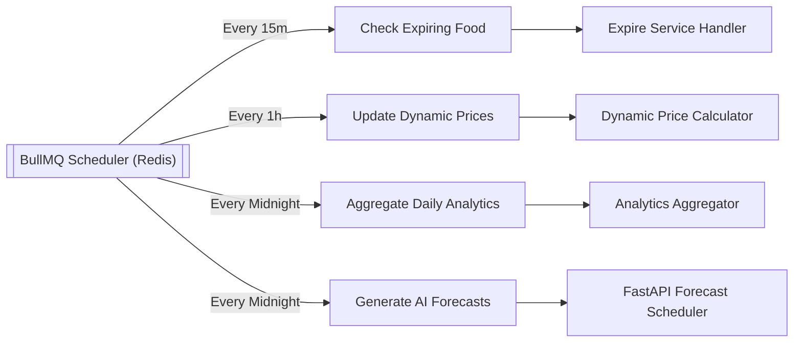
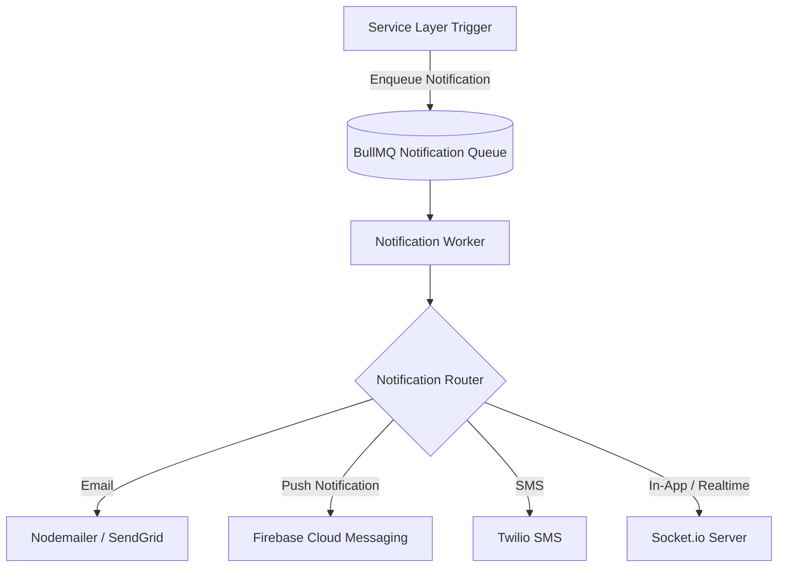

# ZeroWaste OS — Enterprise SaaS Architecture & Blueprint (Phase 1 Revision 2)

This document completes the final architectural design for **ZeroWaste OS**, introducing multi-tenant isolation, structured auditing, background job scheduling, notification frameworks, file asset management, API versioning, event-driven domain handlers, feature toggling, testing models, and mobile responsiveness.

---

## 1. Multi-Tenant Architecture & Data Isolation

To support multiple enterprise food businesses (FBOs) safely on a shared database instance, we implement a **logical database partitioning model** enforced at the application tier.

```mermaid
flowchart TD
    Client[Browser / Mobile App] -->|Request + Tenant Header/JWT| API[Express API Gateway]
    API --> TenantCtx[Tenant Context Middleware]
    TenantCtx -->|Attach context.tenantId| QuerySvc[Service Layer]
    QuerySvc -->|Executes DB query| MongoosePlugin[Mongoose Tenant Filter Plugin]
    MongoosePlugin -->|Appends { tenantId } automatically| MongoDBAtlas[(MongoDB Atlas Database)]
```

### 1.1 Tenant Identification Strategy
Every request is parsed for a `tenantId` context.
* **Extraction Channels**: Checked in order: JWT Claim (`user.tenantId`), Custom Header (`X-Tenant-ID`), or Hostname Subdomain.
* **Context Preservation**: Handled using NodeJS `AsyncLocalStorage` to store the tenant context across the execution stack, avoiding manual parameter forwarding.

### 1.2 Mongoose Multi-Tenancy Plugin
We inject a global Mongoose middleware plugin that automatically enforces tenant boundaries on all reads, updates, and deletes.
```typescript
import mongoose, { Schema } from 'mongoose';
import { AsyncLocalStorage } from 'async_hooks';

export const tenantStorage = new AsyncLocalStorage<{ tenantId: string }>();

export function tenantPlugin(schema: Schema) {
  // Add tenantId field to every schema automatically
  schema.add({
    tenantId: {
      type: mongoose.Schema.Types.ObjectId,
      ref: 'Tenant',
      required: true,
      index: true,
    }
  });

  // Intercept find/query operations
  const applyTenantFilter = function (this: any) {
    const context = tenantStorage.getStore();
    if (context?.tenantId) {
      this.where({ tenantId: context.tenantId });
    }
  };

  schema.pre('find', applyTenantFilter);
  schema.pre('findOne', applyTenantFilter);
  schema.pre('findOneAndUpdate', applyTenantFilter);
  schema.pre('updateMany', applyTenantFilter);
  schema.pre('deleteOne', applyTenantFilter);
  schema.pre('deleteMany', applyTenantFilter);
}
```

---

## 2. Structured Audit Trail

Regulatory food compliance requires auditing of all sensitive mutations.

### 2.1 Collection: `audit_logs`
```json
{
  "_id": { "$oid": "64b0f023e1234567890f0001" },
  "tenantId": { "$oid": "64b0f023e1234567890abcde" },
  "actorId": { "$oid": "64b0f023e1234567890abcdf" },
  "actorRole": "Food Business Owner",
  "action": "FOOD_PRICE_UPDATED",
  "entityId": { "$oid": "64b0f123e1234567890abcdf" },
  "entityModel": "FoodItem",
  "changes": {
    "oldValues": { "discountedPrice": 6.00, "status": "Available" },
    "newValues": { "discountedPrice": 4.00, "status": "Available" }
  },
  "ipAddress": "192.168.1.50",
  "userAgent": "Mozilla/5.0...",
  "timestamp": { "$date": "2026-07-01T12:30:00Z" }
}
```
*Index Strategy:*
* `tenantId` + `timestamp` (compound index for audit log queries).
* `entityId` + `entityModel` (for audit lookup on specific resource pages).

---

## 3. Background Scheduler & Cron Pipeline

We use **BullMQ's Repeatable Jobs** backed by Redis to manage time-based operations.



### 3.1 Job Schedules
```typescript
import { Queue } from 'bullmq';
import { connection } from '../config/redis';

const cronQueue = new Queue('CronSchedulerQueue', { connection });

export async function initSchedules() {
  // 1. Expired food check: Every 15 minutes
  await cronQueue.add('check-expiring-food', {}, {
    repeat: { cron: '*/15 * * * *' }
  });

  // 2. Dynamic price update: Every hour
  await cronQueue.add('update-dynamic-pricing', {}, {
    repeat: { cron: '0 * * * *' }
  });

  // 3. Daily analytics: Every midnight
  await cronQueue.add('generate-daily-analytics', {}, {
    repeat: { cron: '0 0 * * *' }
  });

  // 4. AI demand forecast: Every midnight
  await cronQueue.add('run-ai-forecasting', {}, {
    repeat: { cron: '0 0 * * *' }
  });
}
```

---

## 4. Notification Broker Architecture

The notification subsystem is decoupled from primary request paths. Services push events to the notification queue, and workers dispatch them.



---

## 5. Enterprise Storage Strategy

Unstructured assets are categorized with distinct lifecycle, compression, and access control profiles:

| Asset Type | Storage Target | Privacy Control | Compression/Format Policy |
|---|---|---|---|
| **Marketplace Listings** | Cloudinary (`/marketplace`) | Public | WebP, Auto-compressed, max width 1200px |
| **Verification PDFs (NGO/FBO)** | AWS S3 / Cloudinary Private | Private (Signed URL only) | PDF/A format, virus scanned prior to storage |
| **Delivery Proof Images** | AWS S3 Private | Private | JPEG, 80% quality, geotag metadata retained |
| **Invoices** | AWS S3 Archive / Cloudinary Private | Private | PDF, auto-archived after 90 days to Glacier |

---

## 6. Route Versioning

All endpoints are mapped behind a `/api/v1/` prefix.

```
ZeroWaste OS API
├── /api/v1/auth/
│   ├── POST /register
│   └── POST /login
├── /api/v1/food-items/
│   ├── POST / (Create Listing)
│   └── GET  / (Search and filter)
├── /api/v1/orders/
│   ├── POST / (Place order)
│   └── PATCH /:id/status (Track state)
└── /api/v1/donations/
    ├── POST / (List Donation)
    └── POST /:id/accept
```

---

## 7. Event-Driven Architecture (Domain Events)

Our decoupled architecture uses domain events to react to state changes asynchronously.

```
[FoodCreated]
      │
      ▼
   ( BullMQ Queue: Image & Safety Audit Job )
      │
      ▼
[FoodAudited] ──( If Unsafe )──► [FoodDiscarded]
      │
      ▼ ( If Approved )
[FoodListed]
      │
      ▼
[OrderPlaced] ──► ( Lock Inventory Stock )
      │
      ▼
[DonationCompleted]
      │
      ▼
[AnalyticsUpdated] ──► ( Bust Analytics Caches )
```

### 7.1 Event Payloads
```typescript
interface DomainEvent<T> {
  eventId: string;
  eventName: string;
  timestamp: Date;
  tenantId: string;
  payload: T;
}

export type FoodListedEvent = DomainEvent<{
  foodItemId: string;
  name: string;
  quantity: number;
  location: { coordinates: [number, number] };
}>;
```

---

## 8. Feature Flag Management

We use a config-driven Feature Flag system to control AI and automation execution paths dynamically without redeploying code.

```typescript
export interface IFeatureFlags {
  enableAIForecasting: boolean;
  enableDynamicPricing: boolean;
  enableDonationAutomation: boolean;
  maxSurplusHoldTimeHours: number;
}

// Config collection keying per tenant or global defaults
export const featureFlags = {
  isFeatureEnabled: async (flagName: keyof IFeatureFlags, tenantId: string): Promise<boolean> => {
     // Queries Mongo or Redis cache for current tenant flag configurations
     return true;
  }
};
```

---

## 9. Testing Strategy Matrix

```
┌────────────────────────────────────────────────────────────────────────┐
│                              TEST SUITE                                │
├─────────────────┬─────────────────┬──────────────────┬─────────────────┤
│    Unit Tests   │ Integration Tests│    API Tests     │   Load Tests    │
│  (Jest/Pytest)  │   (Supertest)   │ (Postman/Newman) │  (k6/Artillery) │
├─────────────────┼─────────────────┼──────────────────┼─────────────────┤
│ Isolated logic  │ DB transaction  │ HTTP status      │ 10,000 requests │
│ mock repository │  routing & MQ   │ schema validation│ target latency  │
└─────────────────┴─────────────────┴──────────────────┴─────────────────┘
```

* **Unit Tests**: Coverage target > 85% for core mathematical models and routing helpers.
* **Integration Tests**: Tests database transaction rollbacks and BullMQ job ingestion triggers.
* **Load Testing Target**: 1,000 concurrent websocket connections, and 250 orders per second. Peak latency target: `< 200ms` for geosearch reads.

---

## 10. Mobile Client Optimization & API Readiness

All APIs are designed to support native iOS/Android consumers:

1. **Structured Geolocation**: API payloads use standardized GeoJSON structures `[longitude, latitude]` for mapping integrations (e.g. Mapbox / Google Maps SDKs).
2. **Push Token Lifecycle**: Users collect device tokens on login. These tokens are saved inside the User schema to enable direct pushes via FCM.
3. **Paging Rules**: All listing APIs enforce Cursor-based Pagination instead of page offsets, preventing duplicate items from showing up if products are sold or modified while a mobile user is scrolling.
4. **Optimized Payloads**: Large JSON structures return a partial selection of keys (`?fields=id,name,price`) to reduce mobile bandwidth and rendering overhead.
